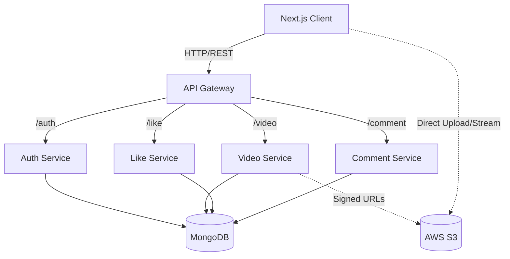

# System Architecture

## Overview
The Tuber Service is a microservices-based video streaming platform inspired by YouTube. It is built using a modern tech stack with a Next.js frontend and a Node.js/Express backend ecosystem. The system is designed to be scalable, maintainable, and efficient, utilizing an API Gateway to manage traffic between the client and various backend services.

## High-Level Architecture

The system follows a microservices architecture pattern, consisting of the following core components:

1.  **Client (Frontend)**: A Next.js 15 application that provides the user interface for browsing, watching, uploading, and interacting with videos.
2.  **API Gateway**: The entry point for all client requests. It routes traffic to the appropriate microservice, handles CORS, and acts as a reverse proxy.
3.  **Microservices**: Independent services responsible for specific domains:
    *   **Auth Service**: Manages user authentication, registration, and token management.
    *   **Video Service**: Handles video metadata, uploading flows, and video management.
    *   **Like Service**: Manages user engagement (likes/dislikes) on videos.
    *   **Comment Service**: Handles user comments on videos.
4.  **Database**: MongoDB is used as the primary data store, with each service (logically) isolating its data needs.
5.  **External Services**:
    *   **AWS S3**: Object storage for raw video files, different HLS streaming resolutions, and thumbnails.
    *   **Video Transcoding**: An external process (triggered via webhooks) to convert raw uploads into HLS streams.

## Component Diagram

## Service Details

### 1. API Gateway
*   **Role**: Reverse Proxy, Routing, CORS termination.
*   **Technology**: Express, `http-proxy-middleware`.
*   **Port**: Configurable (proxies to 4000-4003).
*   **Routes**:
    *   `/auth/*` -> Auth Service
    *   `/video/*` -> Video Service
    *   `/like/*` -> Like Service
    *   `/comment/*` -> Comment Service

### 2. Auth Service
*   **Role**: Identity and Access Management.
*   **Key Features**: JWT generation/verification, Refresh Tokens, Password Hashing (Bcrypt).
*   **Communication**: Provides internal endpoints (`/populate`) for other services to hydrating user data.

### 3. Video Service
*   **Role**: Core video content management.
*   **Key Features**: 
    *   Generates Pre-signed URLs for internal S3 uploads.
    *   Manages video metadata (Title, Description, Status).
    *   Handles "Video Processed" webhooks to publish videos.
    *   Tracks view counts.

### 4. Like Service
*   **Role**: Interaction tracking.
*   **Key Features**: Toggles likes/dislikes on videos.

### 5. Comment Service
*   **Role**: Social interaction.
*   **Key Features**: CRUD operations for video comments.

## Data Flow

### Upload Flow
1.  **Initiation**: User requests to upload a video via Client.
2.  **Metadata**: Client sends metadata to `Video Service`.
3.  **Authorization**: `Video Service` validates user and requests a Pre-signed URL from AWS S3.
4.  **Upload**: Client uploads the file directly to S3 using the pre-signed URL.
5.  **Processing**: An external transcoder processes the video.
6.  **Completion**: Transcoder hits the `/webhook` endpoint on `Video Service` to update status to `Public`.

### Playback Flow
1.  **Fetch**: Client requests video details from `Video Service`.
2.  **Metadata**: Service returns video info, including the HLS manifest URL (hosted on S3/CDN).
3.  **Stream**: Client (Video.js) streams chunks directly from S3/CDN.

## Infrastructure & Deployment
*   **Containerization**: Docker (implied support given architecture, though explicitly mentioned as a gap in current implementation).
*   **Orchestration**: Currently uses `concurrently` for local dev, scalable via Kubernetes or ECS in production.
*   **Storage**: AWS S3 for binary data, MongoDB for structured data.
